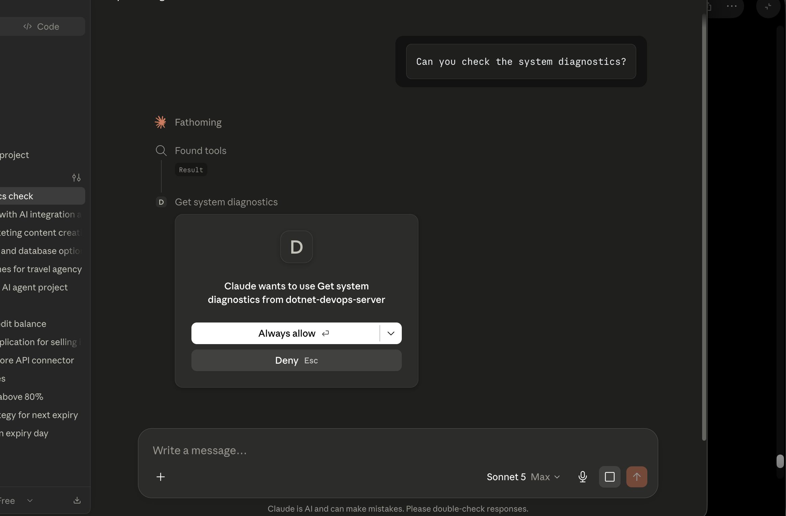

# EnterpriseDevOpsMCP

A Model Context Protocol (MCP) server built with .NET that exposes DevOps and system management tools to Large Language Models (LLMs). This server enables LLMs to interact with enterprise development operations capabilities through a standardized protocol.

## Overview

EnterpriseDevOpsMCP is a .NET-based MCP server that provides a bridge between LLMs and enterprise DevOps tools. It implements the Model Context Protocol to safely expose system diagnostics and operational tools to AI assistants like Claude.

## Features

- **System Diagnostics**: Get real-time memory usage and active process information
- **Stdio Transport**: Secure stdio-based communication with LLM clients
- **Auto-Discovery**: Automatically discovers and exposes all MCP-decorated tools
- **Enterprise-Ready**: Built with dependency injection and proper logging

## Prerequisites

- **.NET 10.0** or later
- **Dotnet CLI** installed and in your PATH
- A compatible LLM client that supports the Model Context Protocol (e.g., Claude with MCP support)

## Installation

1. **Clone or download the repository**:

   ```bash
   cd /path/to/EnterpriseDevOpsMCP
   ```

2. **Restore dependencies**:

   ```bash
   dotnet restore
   ```

3. **Build the project**:
   ```bash
   dotnet build
   ```

## How to Use with LLMs

### Configuration

To use this MCP server with your LLM, configure it in your MCP client settings. The server communicates via stdio (standard input/output).

#### Example Configuration (Claude Desktop / MCP Client)

Add the following to your MCP configuration file (typically `~/.config/claude/claude.json` or similar):

```json
{
  "dotnet-devops-server": {
    "dotnet-devops-server": {
      "command": "dotnet",
      "args": [
        "run",
        "--project",
        "/Users/gautam/Documents/Projects/MCP-Server-DotNet/EnterpriseDevOpsMCP"
      ]
    }
  }
}
```

Or use the included `expose.json` configuration file as a reference.

### Starting the Server

The server runs automatically when invoked by your MCP client. You can also test it manually:

```bash
dotnet run
```

The server will start and listen for JSON-RPC calls via stdio. Output and logs are directed to stderr, while the protocol communication uses stdout.

## How to Use the Tools

Once the server is running and connected to your LLM, you can request the following operations:

### Available Tools

#### 1. **GetSystemDiagnostics**

Retrieves system diagnostics information including memory usage and active thread count.

**Usage from LLM**:

```
"Can you check the system diagnostics?"
```



**Returns**:

- Current memory used by the MCP host process (in MB)
- Active thread count
- Host operating system information

**Example Response**:

```
System Diagnostics - Memory Used by MCP Host: 42 MB. Active Threads: 8. Host OS: Unix 10.15.7.0
```

## Architecture

### Project Structure

```
EnterpriseDevOpsMCP/
├── Program.cs              # Main entry point and tool definitions
├── EnterpriseDevOpsMCP.csproj  # Project configuration
├── expose.json            # MCP server configuration
├── .gitignore            # Git ignore rules
└── README.md             # This file
```

### Key Components

- **MCP Server Setup**: Uses `ModelContextProtocol` NuGet package for protocol implementation
- **Dependency Injection**: Configured via `Microsoft.Extensions.Hosting`
- **Logging**: Properly routes logs to stderr to preserve stdout for protocol communication
- **Tool Discovery**: Uses attributes (`[McpServerToolType]`, `[McpServerTool]`) for auto-discovery

## Development

### Adding New Tools

To add a new tool to the MCP server:

1. Add a new method to the `DevOpsTools` class
2. Decorate it with `[McpServerTool]`
3. Add a `Description` attribute explaining the tool's purpose
4. Return a string with the result

Example:

```csharp
[McpServerTool, Description("Your tool description")]
public static string YourNewTool()
{
    // Implementation
    return "Result";
}
```

### Building for Production

```bash
dotnet publish -c Release -o ./publish
```

### Logging

Logs are output to stderr and will not interfere with MCP protocol communication on stdout.

## Requirements

- **Microsoft.Extensions.Hosting** (v10.0.9)
- **ModelContextProtocol** (v1.4.1)
- .NET 10.0 SDK

## Troubleshooting

### Server won't start

- Ensure .NET 10.0 is installed: `dotnet --version`
- Check that all dependencies are restored: `dotnet restore`
- Verify the project path in your MCP configuration matches your setup

### LLM cannot find the server

- Confirm the server is running and listening on stdio
- Check that the `command` and `args` in your MCP configuration are correct
- Review logs on stderr for any errors

### Tools not appearing in LLM

- Verify all tool methods have the `[McpServerTool]` attribute
- Ensure the tool method is `public static`
- Check the Description attribute is present

## Security Considerations

- This server currently exposes system diagnostics without authentication
- Only expose this server to trusted LLM clients
- For production use, consider adding authentication and authorization layers
- Run with minimal necessary permissions

## Contributing

To extend this MCP server with additional DevOps tools:

1. Add new methods to `DevOpsTools` class
2. Use appropriate attributes for MCP registration
3. Test with your LLM client
4. Document the tool in this README

## License

[Specify your license here]

## Support

For issues, questions, or contributions, please refer to the project repository.

---

**Built with**: .NET 10.0, Model Context Protocol, Microsoft.Extensions.Hosting
